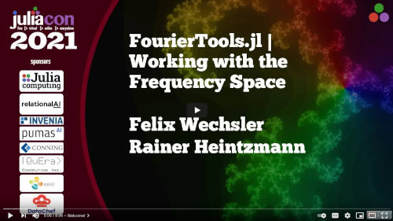

# FourierTools.jl


| **Documentation**                       | **Build Status**                          | **Code Coverage**               |
|:---------------------------------------:|:-----------------------------------------:|:-------------------------------:|
| [![][docs-stable-img]][docs-stable-url] [![][docs-dev-img]][docs-dev-url] | [![][CI-img]][CI-url] | [![][codecov-img]][codecov-url] |


This package contains various functions that are useful for working with and in Fourier space.

## Installation
`FourierTools.jl` is available for all version equal or above Julia 1.6.
It can be installed with the following command

```julia
julia> ] add FourierTools
```

## Features
A quick introduction was given at the JuliaCon 2021.

<a href="https://www.youtube.com/watch?v=qYgJDb_Ko2E"></a>

The main features are:
* sinc interpolation allows to up and downsample a (bandlimited) signal
* FFT based convolutions
* array/image rotation 
* array/image shifting (including noteworthy subpixel shifts)
* array/image shearing
* several tools like `ffts`, `ft`, `fftshift_view` etc. allowing simpler use with Fourier transforms

Have a look in the [examples folder](examples/) for interactive examples. The [documentation](https://bionanoimaging.github.io/FourierTools.jl/dev/) offers a quick overview.


## Cite
If you use this package in an academic work, please cite us!
See on the right side the *Cite this repository*:
```
@misc{Wechsler_FourierTools.jl__Efficiently,
author = {Wechsler, Felix and Heintzmann, Rainer},
title = {FourierTools.jl - Efficiently Working with Fourier Space},
url = {https://github.com/bionanoimaging/FourierTools.jl}}
```


## Related Packages
There are numerous packages related to Fourier transforms which offer similar functions or which we are based on:
* [FFTW.jl](https://github.com/JuliaMath/FFTW.jl) for FFTs
* [NFFT.jl](https://github.com/JuliaMath/NFFT.jl) for non-uniform FFTs
* [FractionalTransforms.jl](https://github.com/SciFracX/FractionalTransforms.jl) offers 1D fractional Fourier transforms


[docs-dev-img]: https://img.shields.io/badge/docs-dev-pink.svg
[docs-dev-url]: https://bionanoimaging.github.io/FourierTools.jl/dev/

[docs-stable-img]: https://img.shields.io/badge/docs-stable-darkgreen.svg
[docs-stable-url]: https://bionanoimaging.github.io/FourierTools.jl/stable/

[CI-img]: https://github.com/bionanoimaging/FourierTools.jl/actions/workflows/ci.yml/badge.svg
[CI-url]: https://github.com/bionanoimaging/FourierTools.jl/actions/workflows/ci.yml

[codecov-img]: https://codecov.io/gh/bionanoimaging/FourierTools.jl/branch/main/graph/badge.svg?token=6XWI1M1MPB
[codecov-url]: https://codecov.io/gh/bionanoimaging/FourierTools.jl
