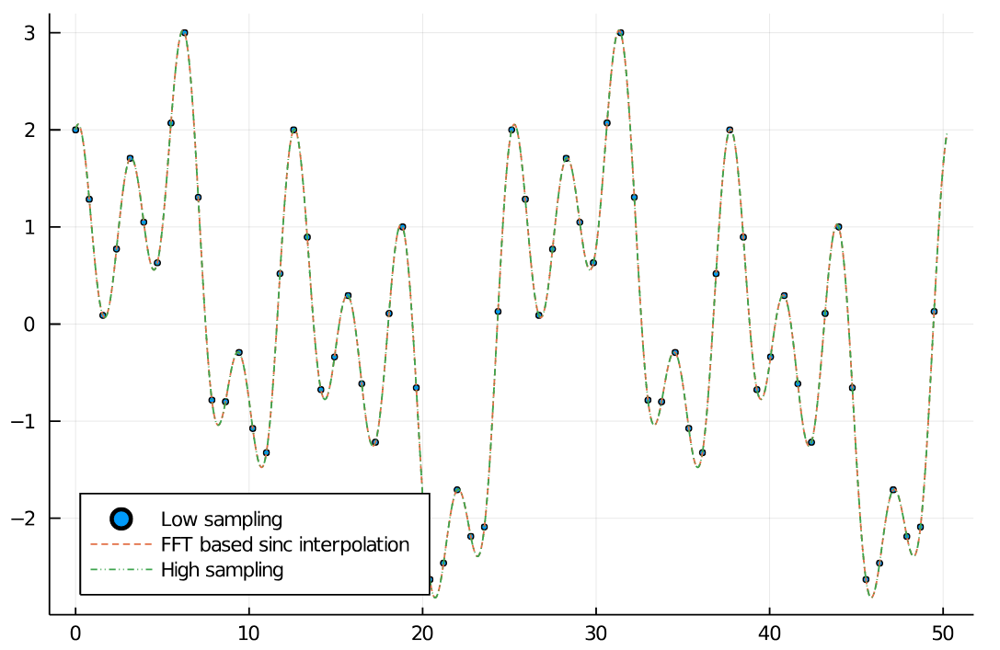

# FourierTools.jl


| **Documentation**                       | **Build Status**                          | **Code Coverage**               |
|:---------------------------------------:|:-----------------------------------------:|:-------------------------------:|
| [![][docs-stable-img]][docs-stable-url] [![][docs-dev-img]][docs-dev-url] | [![][CI-img]][CI-url] | [![][codecov-img]][codecov-url] |


This package contains various functions that are useful in Fourier space. Most noteworth are FFT-based resampling and the 
`ft`, `ift`, `rft`, `irft` functions, which represent FFTs including the Fourier-shift views.

## Installation
`FourierTools.jl` is available for all version equal or above Julia 1.3.
Since it is not registered yet, it can be installed with the following command

```julia
julia> ] add https://github.com/roflmaostc/FFTResampling.jl
```


## Resampling Example

### Sinc interpolation
Below you can find a simple example for up sampling using `resample` and `sinc_interpolate_sum`.
`sinc_interpolate_sum` is a slow sum based method.
Furthermore, there is an image interpolation [Pluto.jl](https://github.com/fonsp/Pluto.jl) notebook in the [examples folder](examples/output_images/).
We can see that the interpolated signal matches the higher sampled signal well.
```julia
 begin
	N_low = 128
	x_min = 0.0
	x_max = 16π
	
	xs_low = range(x_min, x_max, length=N_low+1)[1:N_low]
	xs_high = range(x_min, x_max, length=5000)[1:end-1]
	f(x) = sin(0.5*x) + cos(x) + cos(2 * x) + sin(0.25*x)
	arr_low = f.(xs_low)
	arr_high = f.(xs_high)
end

begin
	N = 1000
	xs_interp = range(x_min, x_max, length=N+1)[1:N]
	arr_interp = resample(arr_low, N)
end

begin
	scatter(xs_low, arr_low, legend=:bottomleft, markersize=2, label="Low sampling")
	plot!(xs_interp, arr_interp, label="FFT based sinc interpolation", linestyle=:dash)
	plot!(xs_high, arr_high, linestyle=:dashdotdot, label="High sampling")
end
```



### Downsampling
32 samples in the downsampled signal should be sufficient for Nyquist sampling.
And as we can see, the downsampled signal still matches the original one.

```julia
begin
	N_ds = 32
	xs_ds = range(x_min, x_max, length=N_ds+1)[1:N_ds]
	arr_ds = resample(arr_high, N_ds)
end

begin
	scatter(xs_low, arr_low, legend=:bottomleft, markersize=2, label="Low sampling")
	plot!(xs_interp, arr_interp, label="FFT based sinc interpolation", linestyle=:dash)
	plot!(xs_ds, arr_ds, label="resampled array", linestyle=:dot)	
end
```


# Image Upsampling
Having a Nyquist sampled image, it is possible to perform a sinc interpolation and creating visually much nicer images.
However, the information content does not change between both images.
The full Pluto notebook is [here](examples/output_images/resample_image.jl).
The right image is the upsampled version of the left one.


[docs-dev-img]: https://img.shields.io/badge/docs-dev-pink.svg
[docs-dev-url]: https://bionanoimaging.github.io/FourierTools.jl/dev/

[docs-stable-img]: https://img.shields.io/badge/docs-stable-darkgreen.svg
[docs-stable-url]: https://bionanoimaging.github.io/FourierTools.jl/stable/

[CI-img]: https://github.com/bionanoimaging/FourierTools.jl/actions/workflows/ci.yml/badge.svg
[CI-url]: https://github.com/bionanoimaging/FourierTools.jl/actions/workflows/ci.yml

[codecov-img]: https://codecov.io/gh/bionanoimaging/FourierTools.jl/branch/main/graph/badge.svg?token=6XWI1M1MPB
[codecov-url]: https://codecov.io/gh/bionanoimaging/FourierTools.jl
