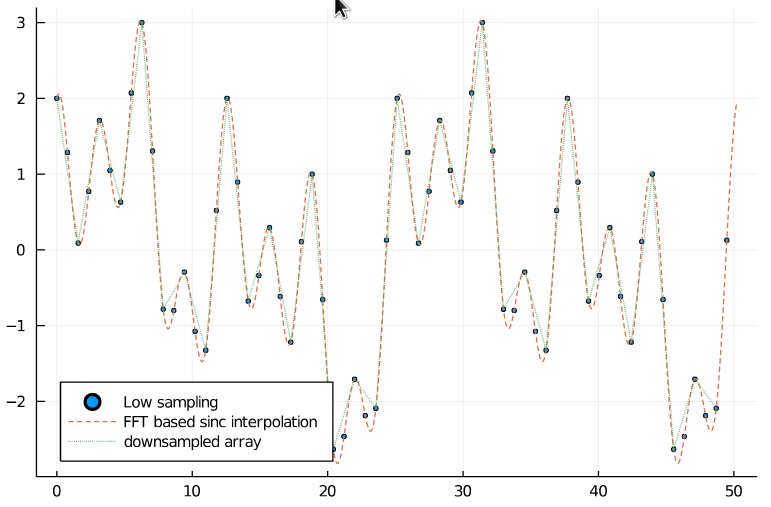

# Resampling
To sinc interpolate a signal, it is possible to zero pad a signal in Fourier space and to do an inverse Fourier transform effectively
evaluating the Fourier series at more samples.
If the signal was initially band-limited, sinc interpolation leads to smoother, perfectly interpolated signals


## Sinc interpolation
Below you can find a simple example for up sampling using `resample`. 
Furthermore, there is an image interpolation [Pluto.jl](https://github.com/fonsp/Pluto.jl) notebook in the [examples folder](https://github.com/bionanoimaging/FourierTools.jl/tree/main/examples/).
We can see that the interpolated signal matches the higher sampled signal well.
```julia
 begin
	N_low = 128
	x_min = 0.0
	x_max = 16π
	
	xs_low = range(x_min, x_max, length=N_low+1)[1:N_low]
	xs_high = range(x_min, x_max, length=5000)[1:end-1]
	f(x) = sin(0.5*x) + cos(x) + cos(2 * x) + sin(0.25*x)
	arr_low = f.(xs_low)
	arr_high = f.(xs_high)
end

begin
	N = 1000
	xs_interp = range(x_min, x_max, length=N+1)[1:N]
	arr_interp = resample(arr_low, N)
end

begin
	scatter(xs_low, arr_low, legend=:bottomleft, markersize=2, label="Low sampling")
	plot!(xs_interp, arr_interp, label="FFT based sinc interpolation", linestyle=:dash)
	plot!(xs_high, arr_high, linestyle=:dashdotdot, label="High sampling")
end
```


## Downsampling
32 samples in the downsampled signal should be sufficient for Nyquist sampling.
And as we can see, the downsampled signal still matches the original one.

```julia
begin
	N_ds = 32
	xs_ds = range(x_min, x_max, length=N_ds+1)[1:N_ds]
	arr_ds = resample(arr_high, N_ds)
end

begin
	scatter(xs_low, arr_low, legend=:bottomleft, markersize=2, label="Low sampling")
	plot!(xs_interp, arr_interp, label="FFT based sinc interpolation", linestyle=:dash)
	plot!(xs_ds, arr_ds, label="resampled array", linestyle=:dot)	
end
```




## Image Upsampling
Having a Nyquist sampled image, it is possible to perform a sinc interpolation and creating visually much nicer images.
However, the information content does not change between both images.
The full Pluto notebook is [here](https://github.com/bionanoimaging/FourierTools.jl/tree/main/examples/resample_image.jl).
The right image is the upsampled version of the left one.


## Function references
```@docs
FourierTools.resample
```
