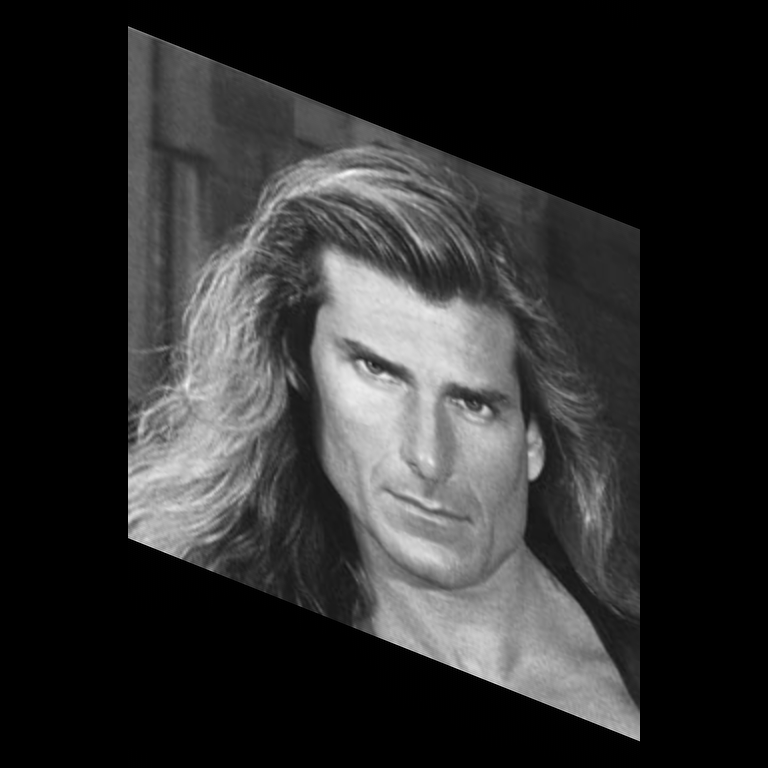

# Rotation with FFT
Via shear it is possible to rotate an image.
Shearing is basically a shift operation but with different shift distance in each row.


## Examples
For full interactivity, have a look at this [Pluto notebook](https://github.com/bionanoimaging/FourierTools.jl/tree/main/examples/shear.jl).
```julia
using Revise, FourierTools, Plots, TestImages, PlutoUI, ImageShow

begin
    img = Float32.(testimage("fabio_512_gray"))
    z = zeros(Float32, (768, 768))
    FourierTools.center_set!(z, img)
end

Gray.(FourierTools.shear(z, -305))
```



# Function references
```@docs
    FourierTools.shear
    FourierTools.shear!
```
