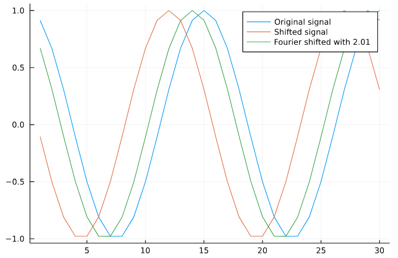

# Shifting

Using the [Fourier shift property](https://en.wikipedia.org/wiki/Fourier_transform#Modulation_/_frequency_shifting) one can implement shifting of arrays not only over pixel but also sub-pixel amount.

## Examples
For full interactivity, have a look at this [Pluto notebook](https://github.com/bionanoimaging/FourierTools.jl/tree/main/examples/shifting.jl).


```julia
begin
    f(x) = cos(4π * x / 30)
    x1 = 1:30
    x2 = x1 .+ 3
end

begin
    y1 = f.(x1)
    y2 = f.(x2)
    offset = 2.01
    y3 = shift(y2, tuple(offset))
end

begin
    plot(y1, label="Original signal")
    plot!(y2, label="Shifted signal")
    plot!(y3, label="Fourier shifted with $offset")
end
```


# Function references
```@docs
    FourierTools.shift
    FourierTools.shift!
```
